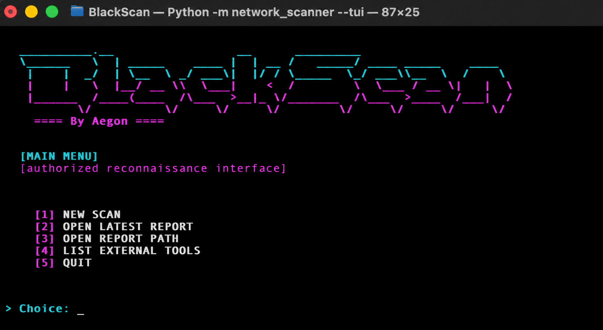
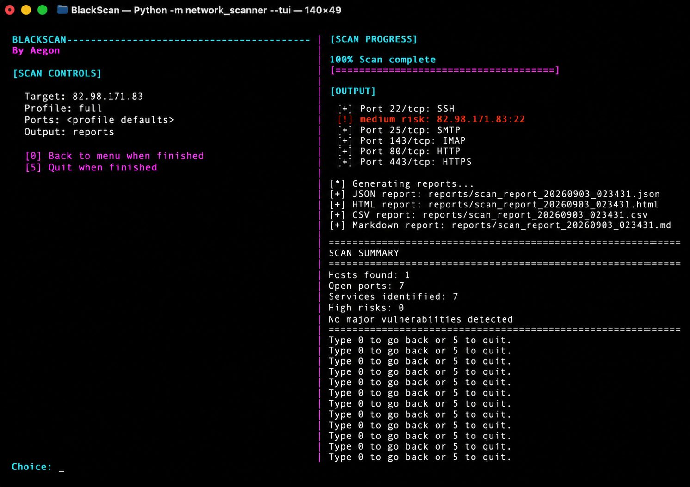

# BlackScan

BlackScan is an educational, authorized network scanner written in Python. It is designed for lab use, VM ranges, and owned infrastructure where you have explicit permission to test.

It performs host discovery, TCP port scanning, lightweight service fingerprinting, basic HTTP/TLS checks, risk scoring, and report generation. It is not a replacement for mature tools such as Nmap or commercial vulnerability scanners.

## Screenshots

### Main Menu



### Scan Example



## Scope and Safety

- Use BlackScan only on systems you own or are explicitly authorized to assess.
- The CLI requires `--authorized` before scanning.
- Intrusive checks are disabled by default and require `--intrusive-checks`.
- Automatic exploitation is disabled. The legacy `auto_exploit` module only returns review context or raises a safety error.
- Credential-audit helpers are guarded, capped, and not exposed by the main CLI.

## Features

- Host discovery by ICMP ping with TCP fallback probes.
- Concurrent TCP port scanning.
- Scan profiles: `quick`, `web`, `internal`, `full`, and `stealth`.
- HTTP fingerprinting: status, title, redirects, selected headers, cookies, favicon hash, common paths, and sensitive path probes.
- TLS metadata and certificate verification summary.
- Optional proxy support for HTTP/HTTPS fingerprinting requests.
- Lightweight vulnerability checks for common exposure patterns.
- Risk scoring per service.
- Reports in JSON, HTML, CSV, and Markdown.
- Interactive TUI for configuring scans and reviewing generated JSON reports.
- Optional comparison against a previous JSON report.
- Vulnerability trend analysis across multiple JSON reports.
- Detection of external tools such as `nmap`, `nuclei`, `httpx`, `subfinder`, and `dnsx`.

## Installation

Python 3.10 or newer is required.

Recommended setup after cloning:

```bash
git clone <repository-url>
cd BlackScan
chmod +x install.sh
./install.sh
source venv/bin/activate
blackscan --help
```

The installer creates a local `venv`, upgrades the build tools, installs BlackScan in editable mode, creates `reports/`, and verifies that the CLI can start.

For optional credential-audit dependencies:

```bash
./install.sh --audit
```

For development and tests:

```bash
./install.sh --dev
```

If `python3` is not the Python executable you want to use:

```bash
PYTHON=/path/to/python3 ./install.sh
```

## Usage

Show the CLI help:

```bash
blackscan --help
```

Run a small authorized scan:

```bash
blackscan -t 192.168.56.0/24 --authorized --profile quick
```

Scan selected ports:

```bash
blackscan -t 192.168.56.10 --authorized --ports 22,80,443,8000-8010
```

Run web-focused checks:

```bash
blackscan -t 192.168.56.10 --authorized --profile web
```

Route HTTP/HTTPS fingerprinting through a proxy:

```bash
blackscan -t 192.168.56.10 --authorized --profile web --proxy http://127.0.0.1:8080
```

Enable intrusive checks only inside an authorized lab:

```bash
blackscan -t 192.168.56.10 --authorized --profile internal --intrusive-checks
```

Compare with an older JSON report:

```bash
blackscan -t 192.168.56.0/24 --authorized --compare reports/scan_report_previous.json
```

Analyze vulnerability evolution across existing reports:

```bash
blackscan --trend reports/scan_report_old.json reports/scan_report_new.json
```

List optional external tools detected on the machine:

```bash
blackscan --list-external-tools
```

Open the interactive terminal UI:

```bash
blackscan --tui
```

From the TUI you can start a new scan, confirm authorized scope, set target/profile/ports/proxy/options, list external tools, or open reports. The TUI uses numbered choices: type the number shown on screen and press Enter.

Open a specific JSON report directly in the report viewer:

```bash
blackscan --tui reports/scan_report_20260902_173005.json
```

You can also run the module directly without activating the environment:

```bash
venv/bin/python -m network_scanner --help
```

## Reports

By default reports are written to `reports/`:

- `scan_report_<timestamp>.json`
- `scan_report_<timestamp>.html`
- `scan_report_<timestamp>.csv`
- `scan_report_<timestamp>.md`

Use `-o` or `--output-dir` to choose another output directory.

Trend analysis writes:

- `vulnerability_trend_<timestamp>.json`
- `vulnerability_trend_<timestamp>.md`

## Project Layout

- `network_scanner/scanner.py`: main CLI and report generation.
- `network_scanner/core/ui.py`: interactive TUI for scan setup and JSON report review.
- `network_scanner/settings.py`: scan profile and port defaults.
- `network_scanner/modules/ping_sweep.py`: host discovery.
- `network_scanner/modules/port_scanner.py`: TCP port scanner.
- `network_scanner/modules/service_scan.py`: service, HTTP, and TLS fingerprinting.
- `network_scanner/checks/`: vulnerability check framework and built-in checks.
- `network_scanner/modules/risk.py`: service risk scoring.
- `network_scanner/modules/report_diff.py`: report comparison and vulnerability trend analysis.
- `network_scanner/modules/brute_force/`: guarded credential-audit helpers for lab use.
- `config/exploit_config.yaml`: compatibility config documenting disabled offensive workflows.
- `tests/`: unit tests.

## Development

Run tests:

```bash
source venv/bin/activate
python -m unittest discover -s tests -v
```

Run lint:

```bash
ruff check .
```

The repository CI runs both commands across Python 3.10, 3.11, and 3.12.

## VM Lab Notes

For educational testing, use an isolated host-only or NAT VM network. Good test targets are intentionally vulnerable lab machines or small services you start yourself. Keep scans limited at first:

```bash
blackscan -t 192.168.56.0/24 --authorized --profile quick --timeout 1
```

Increase scope only after confirming the target range and VM network are correct.

## Troubleshooting

If `blackscan` is not found, activate the virtual environment:

```bash
source venv/bin/activate
```

If installation fails while downloading packages, check internet access and rerun:

```bash
./install.sh
```

If macOS blocks execution of the installer, restore the executable bit:

```bash
chmod +x install.sh
```
